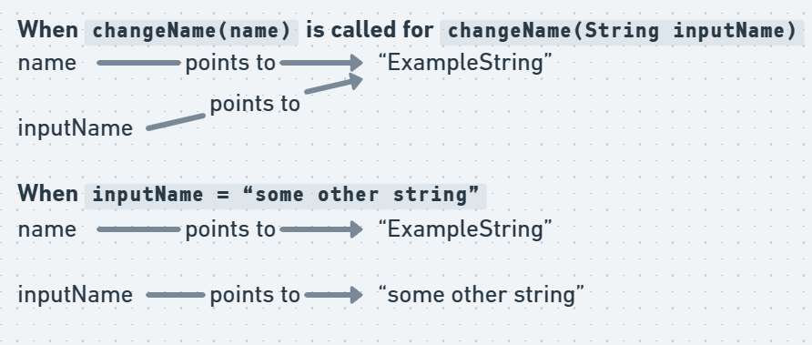
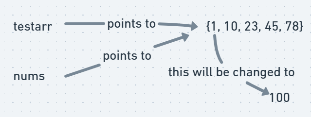

# Data structures and algorithms

_This is a reference for data structures and algorithms made for the [Java + DSA + Interview Preparation Course](https://www.youtube.com/playlist?list=PL9gnSGHSqcnr_DxHsP7AW9ftq0AtAyYqJ)_

## (Video 5-8) Introduction to programming

### Types of languages

[Good video here](https://www.youtube.com/watch?v=aoE-92Ac4zE)

1. Procedural programming - well structured steps and procedures to compose a program and step by step execution

2. Functional programming - Writing a program using only pure functions. Pure functions have the following properties

   1. the function return values are identical for identical arguments (no variation with local static variables, non-local variables, mutable reference arguments or input streams), and
   2. the function has no side effects (no mutation of local static variables, non-local variables, mutable reference arguments or input/output streams).

3. Object oriented programming - based on objects

### Static vs dynamic langauges

1. Static - perform type checking at compile time and type errors will be discovered at compile time. Need to declare data type explicitly

2. Dynamic - perform type checking at run time and type errors may be discovered late during program execution. Variable data type is inferred

### Stack vs heap

**_c++ implementation_**

https://courses.engr.illinois.edu/cs225/fa2022/resources/stack-heap/

1. Stack - Stores local variables (and the data associated with the local variables). AFter a function returns, the stack memory associated to that functions and all of it's variables are deallocated. **A common mistake is to return a pointer to a stack variable from a helper function and using that returned pointer elsewhere.**

2. Heap - dynamic memory for programmers to allocate. **Unlike stack memory, heap memory is allocated explicitly by programmers and it won’t be deallocated until it is explicitly freed.**

**_Java implementation_**

Primitives are stored in the stack memory only. Non primitives (objects) are stored in the heap memory.

yet to be added

### Prime number algorithm optimization

```
take input
initialize i = 2
while i < sqrt(number)
    if number % i == 0
        print "not prime"
        exit()
    i = i + 1

print "prime"
```

### Java Architecture

In java, everything extends into an object class.

Java is both a compiled as well as an interpreted programming language. [Compiled vs interpreted](https://www.freecodecamp.org/news/compiled-versus-interpreted-languages/)

1. The `.java` file which is human readable (soure code) is first compiled by the compiler

2. This compiler compiles the source code into `.class` bytecode which is an intermediate code that is platform independent

3. The intermediate bytecode is then executed line by line by the interpreter.

### Compiling and running file

To compile file, use the following command. This will create a compiled bytecode `.class` file

```
javac filename.java
```

To run the compiled `.class` file using the interpreter, use the following command with the name of the `.class` file.

```
java filename
```

### Basic file structure

```
public class Demo {
    public static void main(String[] args) {
        System.out.println("Hello World!");
}
```

If the file name is `Demo.java` then the class inside the file should also be named `Demo`. Any other name will not work. The `main`(from psvm) function is the entry point of any java program and therefore is necessary

`public` from `public static void main(String[] args)` is an access specifier. Since `main` is the entry point and without it the program will not run, it is necessary to make it accessible from anywhere, hence it should be specified public.

`static` is used to run the `main` function without creating an object of `class Demo`. In java, everything is based on a class-object relationship. Since main is the entry point, we cannot create an object of `class demo`. In order to create an object, we need to first run the code that creates the object and that is not possible because main is where the program starts running. We use `static` keyword to solve this problem.

`void` is the return type of the main function.

### Classes convention

All class names should begin with capital letters. For example, `Scanner` import used for taking inputs is actually a pre defined class.

### Taking inputs in java

Use the Scanner class to take inputs in java. Do not forget to import the Scanner class using `import java.util.Scanner;`

_This code will go into psvm_

```
Scanner input = new Scanner(System.in);
int number = input.nextInt();
input.close();
```

### Primitive data types

String is NOT primitive data type. It is a class. Following are some primitive data types.

```
int number = 62;
char letter = 'a';
float floatingNumber = 98.34f;
double largeDecimalNumbers = 34337.3433;
long largeInteger = 34329382329328L;
boolean check = false; // or true
```

### Literals, identifiers, references and objects

_redo this entire part again_

https://java-programming.mooc.fi/part-5

A **literal** is a notation for representing a fixed constant value. For example, in `int number = 42` 42 is the literal because 42 is literally 42, a constant. Whereas the variable `number` here is the identifier.

**[Constants vs literals](https://stackoverflow.com/a/44767471/16465011)**.

**Identifier** - All Java variables must be identified with unique names. Identifiers in Java are symbolic names used for identification. They can be a class name, variable name, method name, package name, constant name, and more. Identifiers can be short names (like x and y) or more descriptive names (age, sum, totalVolume)

**Reference** -

### Typecasting and promotions

A widdening type cast (done automatically by java) is when a smaller type is converted into a larger type. For example, if a float is expected as input and as int is provided instead, java will automatically convert the int to a float.

A narrowing type cast is when a larger type is to be converted to a smaller type. This is not done automatically and needs to be done manually using `(typeToCastInto)(data)`

Types should be compatible in order to cast them. A string cannot be cast into an int

#### Automatic type promotion in expressions

If the larger value being cast into smaller type cannot fit, java will use `(largerValue) % (max value of smaller type)`. For example,

```
int a = 257;
byte b = (byte)(a); // max value of byte is 256, so java will use 257 % 256
System.out.println(b);

//output of this will be 1
```

If an expression uses two different data types, java will use widdening (if compatible) to compute the expression. For example, while carrying out `3 * 5.6` java will convert the entire expression into float and the output will be in float.

## (Video 9) Conditionals

### When to use a for loop and when to use a while loop

**For loop** - Use this when you know how many times the loop is going to run. For example, print the first 10 numbers

**While loop** - Use this when you don't know how many times the loop will run. For example, take input from user until the user presses a particular button.

A while loop also sometimes improves code readability

### Difference between do while and while loop

**do while** - In a do while loop, the loop will execute at least once and then the while condition will be checked. Use in cases where running the loop at least once is a requirement.

**while** - Loop may not even run once if the while condition fails

### Print the nth fibonaci number

```
1. take input
2. num1 = 0, num2 = 0, sum = 0
3. print num1 and num2
3. for(int i = 2; i <= target; i++){
    sum = num1 + num2;
    num1 = num2
    num2 = sum
}
4. print sum
```

### Find occurrence of a digit in a number

```
1. input n and target
2. digit = 0, count = 0;
3. while(n != 0){
    digit = n % 10;
    if(digit == target)
        count++;
    n = n / 10;
}
4. print count
```

### Print reverse of a number

#### My solution

```
1. input n
2. placeExponent = -1, temp = n, ans = 0, digit = 0;
3. figure out placeExponent
    do{
            temp = temp / 10;
            placeExponent++;
    } while(temp != 0);

4. places = 10 ^ placeExponent // use pow function and explicitly typecast into (int) to truncate decimals
5. reverse number
    while(places > 0){
            digit = n % 10;
            ans = ans + places * digit;
            n = n / 10;
            places = places / 10;
    }
6. print ans
```

#### Best solution

```
1. input number
2. ans = 0, digit = 0;
3. reverse number
    while(n != 0){
            digit = n % 10;
            ans = ans * 10 + digit;
            n = n / 10;
    }
4. print ans
```

## (Video 10) Switch statements + nested cases

### `.equals`

_needs to be redone_

Use the `.equals` method to compare if two string are equal. Using `==` may give incorrect results.

Suppose we have a string "test" in two separate objects. If we try to compare "test" using `==` we may get false. This is because `==` compares the references to objects (in this case, two different objects hence will give false). Comparing using `.equals` method will return true since it actually checks the value and not the reference.

```
String word1 = "hello";
String word2 = "hello";
System.out.println(word1.equals(word2)); // will print true because both strings are equal.
```

### Syntax of switch

`expression` and the cases should be of the same data type and must be either a constant or a literal. For example, if `expression` is a string then case should be a string (`case "Apple":`). Cases can also be blank (`case one: //nothing` is also allowed).

```
switch(expression) {
    // cases
    case one:
        // case code here
        break;
    case two:
        // case code here
        break;
    default:
        // case code here
}
```

### Enhanced switch syntax

A better switch syntax, break statements are not required and increases readability.

```
switch(expression) {
    case one -> System.out.println("case code here");
    case two -> // case code here;
    default -> // default case here;
}
```

### Nested switch cases

A switch case can also be added as a case in another switch case.

## (Video 11) Functions / Methods

### Syntax of a method

```
access_modifer return_type name(){
    // function body
}
```

If the function is being accessed without creating an object of a class, it needs to be declared `static`. A function being called from a `static` function should also be declared `static`.

Declare a function with `public static void name(){}` if static. `public` is optional because the default is `public`.

### Passing to a method / function

There is **no pass by reference in java** unlike in C/C++ and other languages. Only pass by value is allowed.

#### Pass by value

Say for example we have a method `changeName(String inputName)` and we pass `name` to it using`changeName(name)`.

When you change `inputName` inside of `changeName` scope, `inputName` will just point to a new object (memory space) and it will stop referencing to the old object



As a result, the original `name` remains unaffected.

In case of primitives, a copy of the object is directly given to the argument variable and it just points at it's own new object (instead of the argument variable pointing to the original)

#### When the same object is changed, it changes everywhere.

Suppose we have an array `int[] testarr = {1, 10, 23, 45, 78}` and we have a `changeArray(int[] nums)` function. Inside `changeArray` if we write `nums[0] = 100` this will actually change the value of the first index of `testarr` since the function argument array `nums` and `testarr` point to the same object



Even though this does feel like call by reference, it is not since we are not passing the memory address of the object.

[They are no pointers in java](https://stackoverflow.com/questions/2629357/does-java-have-pointers).

### Scope

Methods - Variables inside a method can only be accessed from that method only

Blocks and functions - Anything initilized outside the block can be used inside, but anything initialized inside the block cannot be used outside (same for loops)

### Shadowing

```
public class Shadowing {
    static int x = 90; // will be shadowed when int x = 40;
    public static void main(String args[]) {
        sout(x); // will print 90
        int x = 40;
        sout(x); // will print 40
        fun();
    }
    public static fun(){
        sout(x); // will print 90 again because global scope
    }
}
```

The first integer (global scoped) is static because it's being used in a static function `main`.

### Variable length arguments VarArgs

Use varArgs when you do not know how many arguments are being passed to a method.

```
static void fun(datatype ...varArg_name) {
    // method body here
}
// also possible
static void fun(datatype var1, datatype var2, datatype ...v){}
```

varArgs are stored as an array so array operations are allowed using the varArg_name.

## (Video 12) Array and arraylist

### Arrays

Collection of data of the same type.

```
// syntax
datatype[] variable_name = new datatype[size];
// this also works
datatype[] variable_name = {data here};

int[] testarr; // declaration of array
testarr = new int[5]; // initialization (creates an object in the heap)

// String array
String[] stringArray = new String[3]; // will create an array with 3 strings
```

Declaraton of array happens at compile time. Initialization of array happens at runtime(dynamic memory allocation).

Objects in heap in java are stored non contiguously.

The `new` keyword creates new objects. Int Arrays initialized using new keyword have the **default value of 0**. String arrays are **initialized to null.**

`null` is a special literal. It cannot be assigned to primitive data types

### Enhanced for loop (for each loop)

Useful for when you just want to iterate.

```
// syntax
for(datatype variableName : arrayName) { // or collectionName
    // code block
}
```

The `variableName` holds the current element of the `arrayName` in each iteration. The type must match the type of the elements in the arrayName.

[Don't use for each loop to take input. It is only used to read from array, not write to it. Use normal loop instead](https://stackoverflow.com/questions/54691873/how-to-use-for-each-in-java-to-get-input)
